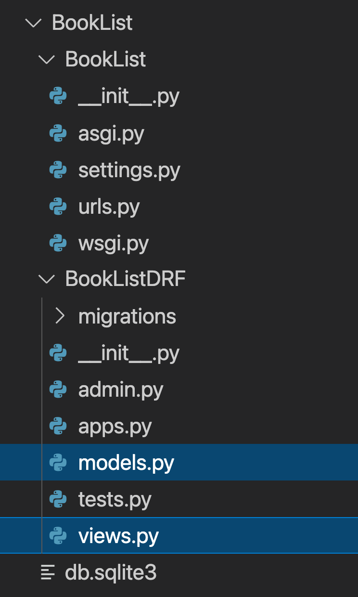
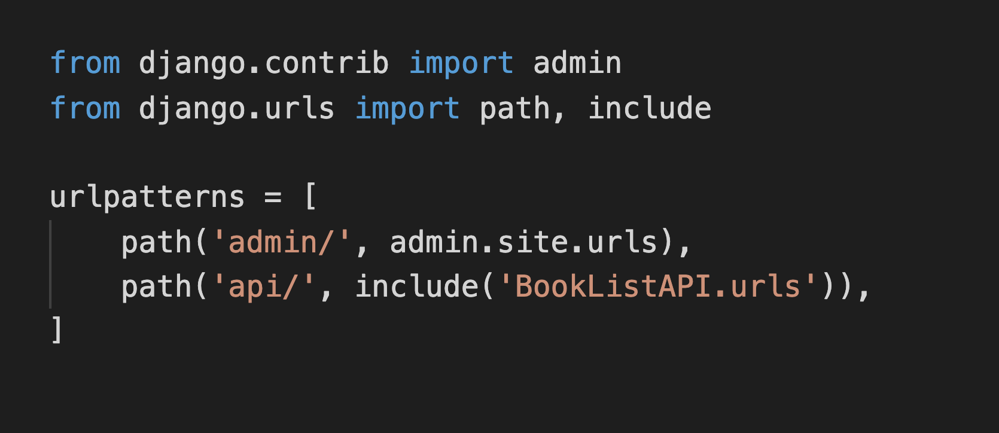
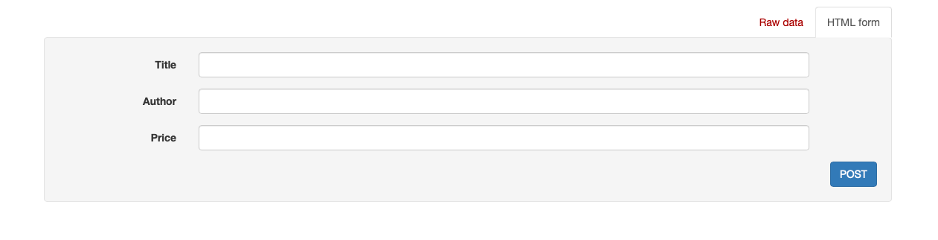
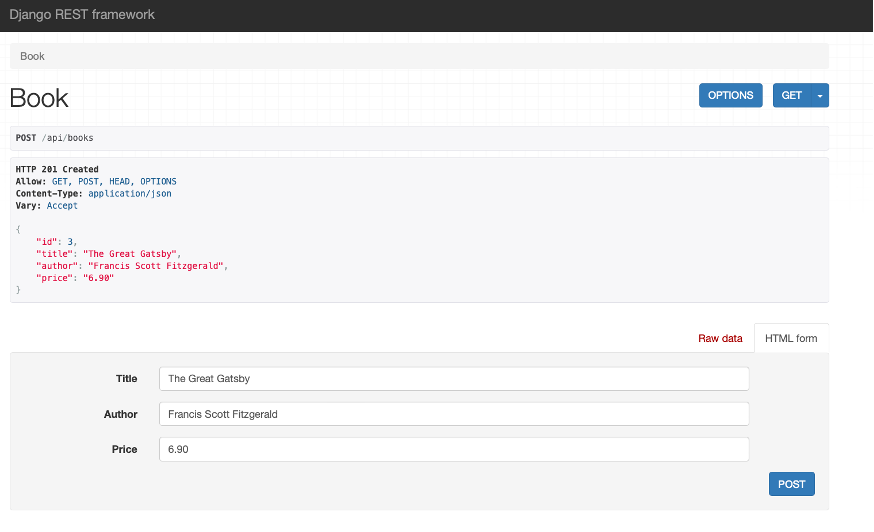
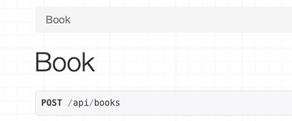
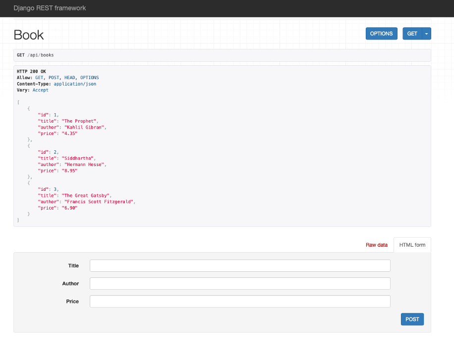
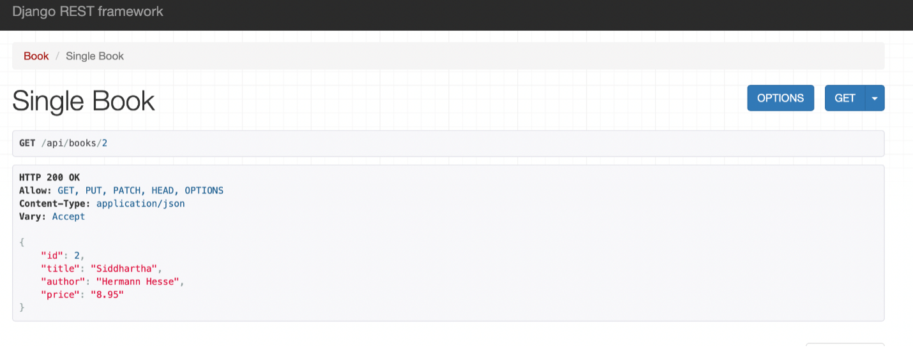

# C6M2L1 Item 09: Convert Booklist API Project to DRF

**Goal**

In this lab, you will practice creating a project using serializers in Django Rest Framework (DRF).

**Objectives**

- Use serializers in DRF to model data inside web applications.
- Use the GET and POST methods to update data entries in DRF.

**Introduction**

In the previous lab exercise, you used Django to create APIs for a book list project. For this lab exercise, you will use the same model that you created for the BookList project but instead, you will create an API using DRF.

**Scenario**

You already created APIs for the book list project, but since then you've learned about the advantages of using DRF over just using Django. You informed the manager and they've asked you to improve the APIs you developed to ensure a better end-user experience.

Your task is to improve the book list project by building it in DRF.

**Learner Instructions**

This lab will require you to modify the following files:

- **views.py**
- **urls.py** (at the app level)
- **models.py**
- **serializers.py**



**Note:** In the image above, serializers.py and urls.py (app-level) are not created with the project. 

Additionally, you must start the development server on the local host and go to the localhost URL to confirm the desired view on the webpage.

When required, open the **Terminal** by selecting **New Terminal** under **Terminal** in VS Code.

The Django project called **BookList** and Django app called **BookListDRF** are already in place.

**Note:** Before you begin, make sure you understand how to work with the Coursera Code Lab for the [APIS course](https://www.coursera.org/learn/apis/supplement/WXiq5/working-with-labs-in-this-course).

Follow the instructions below and ensure you check the output at every step.

**Step 1:**
Create a **'urls.py'** file at the app level, add the `path()` function inside the `urlpatterns` list and pass the following arguments to it:

- A URL path string beginning with the suffix `'books'`
- The relative path of the view function that will be called `BookView`. Call `as_view()` function on the `BookView`.
-

**Step 2:**

Open the **urls.py** file at the project level and import the `include()` function from the package `django.urls`.

_ **Tip:** _ _Do not add round brackets while importing a function in an import statement._

The final code inside the project-level **urls.py** file will appear as below:


**Step 3:**

Update the `urlpatterns` list to include the path of the app-level urls by adding a `path()` function with the following arguments:

- A path string labeled `'api/'`
- An include function with `'BookListDRF.urls'` passed as an argument

_ **Note:** _ _Make sure you add a comma (`,`) at the end of the_ `path()` _function._

**Step 4:**

Open the **models.py** file and create a class called `Book` inside it and pass `models.Model` to it as a parameter.

**Step 5:**

Create the three attributes that you need in the model (`title`, `author` and `price`) and assign the respective form fields to them.

Additionally, pass the following arguments to those form fields:

| **Attribute**   | **Form field type**   | **Arguments**   |
| --- | --- | --- |
| title  | CharField  | max\_length = 255  |
| author  | CharField  | max\_length = 255  |
| price  | DecimalField  | max\_digits= 5, decimal\_places= 2  |

**Step 6:**

Now create a file called **serializers.py** inside the app level **BookListDRF** directory.

**Step 7:**

Open the file and import:

- The `Book` class from the **models** file
- The `serializers` package from the `rest_framework`

**Step 8:**

Create a class called `BookSerializer` and pass the class object `serializers.ModelSerializer` to it as an argument.

**Step 9:**

Inside the `BookSerializer` class, create another class called `Meta` and add the following code inside the class:

- Assign the `Book` model to a variable called `model`
- Create a list of strings with four items namely: `'id'`, `'title'`, `'author'` and `'price'` and assign this list to a variable called `fields`.

**Step 10:**

Open the file **views.py** and import the following inside it:

- the `Book` model from the **models** file
- `BookSerializer` from the **serializer** file
- `generics` from the DRF package `rest_framework`

**Step 11:**

Create a class called `BookView` and pass `generics.ListCreateAPIView` to it as an argument.

**Step 12:**

Inside the `BookView` class:

- Assign the value of `Book.objects.all()` to a variable called `queryset`
- Assign the value of `BookSerializer` to a variable called `serializer_class`

**Step 13:**
Open the Terminal in VS Code and run the two commands to perform the migrations.


**Step 14:**

Once the migrations are performed successfully, run the command to start the server on the localhost and go to the URL: `http://127.0.0.1:8000/api/books`


You should be able to see a page and at the bottom see a form such as this:



**Step 15:**
Now enter the details of the following books in the bottom section, one at a time:

**- Title: The Prophet**

**- Author: Kahlil Gibran**

**- Price: 4.35**

*
**- Title: Siddhartha**

**- Author: Hermann Hesse**

**- Price: 8.95**

*

**- Title: The Great Gatsby**

**- Author: Francis Scott Fitzgerald**

**- Price: 6.90**

Press the **POST** button at the bottom of the screen. You should be able to see the result of the **POST** request on the screen as follows:



**Step 16:**
Click on the `Book` button at the top left corner of the screen to see all the entries inside the model you have created.



It will open a page that will display all the results. In this way, DRF provides a consolidated and convenient view of the model entries inside your browser.



**Additional steps: **

Keep the server running and go to the **views.py** file and add the following code to create a new view called `SingleBookView` Add the following code inside it:

```
class SingleBookView(generics.RetrieveUpdateAPIView):
    queryset = Book.objects.all()
    serializer_class = BookSerializer
```

Update the app-level **urls.py** and update the `urlpatterns` with the following entry:

`path('books/<int:pk>', views.SingleBookView.as_view()),`

Save both the files and refresh your webpage in the browser.

You can now access individual books by their `'id'`. Suffix the URL path with an id of your choice from the entries inside your model such as:

`http://127.0.0.1:8000/api/books/2`

It should return a view of a single book as below:



**Concluding Thoughts**

In this lab, you practiced creating a template for a book list using a Serializer in DRF. You also learned how to create and update data entries in a DRF view.