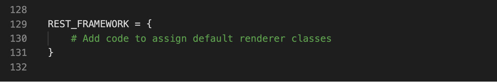
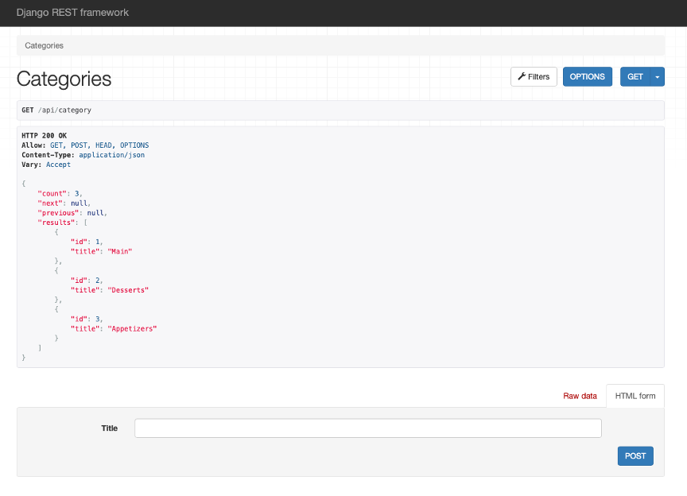
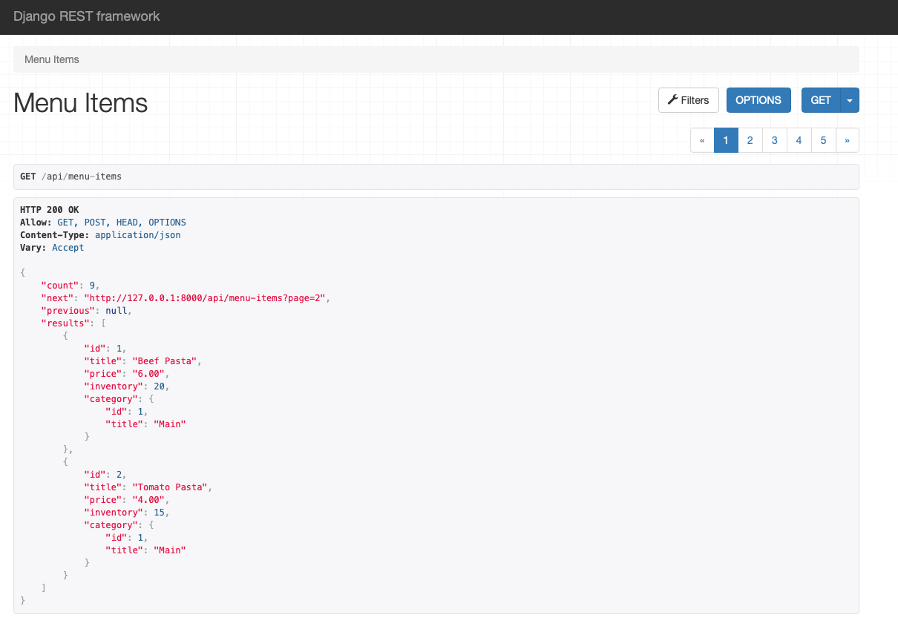
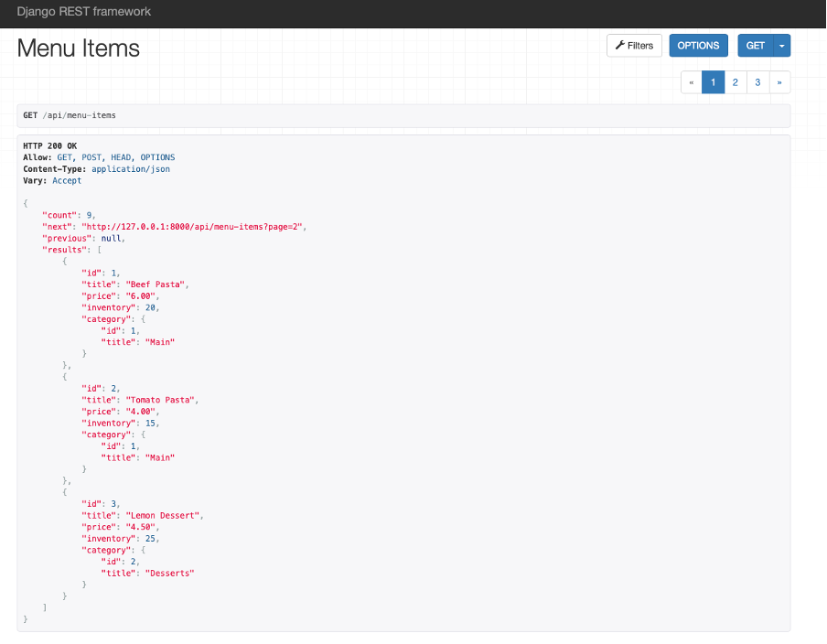
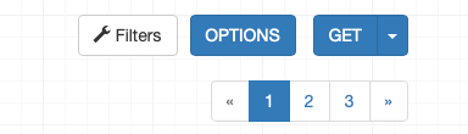
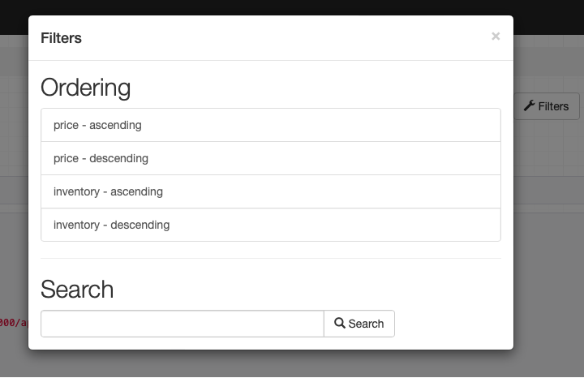
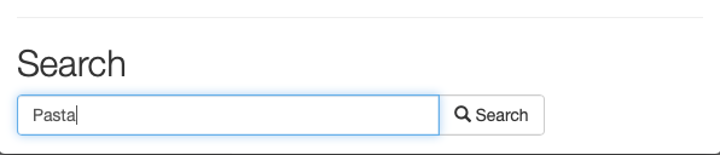
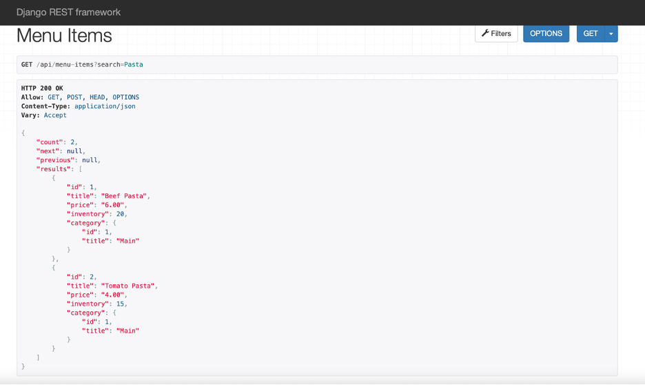

# C6M3L1 Item 07 - Restaurant Menu API - Filtering, Ordering and Searching


**Goal**

Add functionalities such as pagination, ordering and searching in HTML form using DRF

**Objectives**

- Create HTML forms and add new items
- Add pagination settings for DRF form
- Add filtering options such as ordering and searching

**Introduction**

In this lab, you will create a model called **Category** and another model called **Menu** that has a many-to-one relationship with the model **Category**. You will use DRF to add searching and ordering functionalities. You will also learn how to generate a view consisting of a specific number of items from a table that will be displayed on a page.

**Scenario**

Adrian and Mario are the owners of Little Lemon restaurant and they have a website for their business. While the basic functionalities are already in place, Mario also wants a feature on their website that will help them keep track of their inventory and update the prices of menu items with ease. As a developer hired to update the website, it's your job to help the owners by building this functionality in their website.

**Learner Instructions**

This lab will require you to modify the following files:

- views.py
- serializers.py
- models.py
- settings.py
- urls.py (app-level)

Start the development server on the local host and go to the URL to confirm the desired view is on the webpage.

When required, Open the **Terminal** by selecting **New Terminal** under Terminal in the Menu bar of VS Code.

The Django project called **LittleLemon** and Django app called **LittleLemonDRF** are already in place.

**Note:** Before you begin, make sure you understand how to work with the Coursera Code Lab for the [APIS course](https://www.coursera.org/learn/apis/supplement/WXiq5/working-with-labs-in-this-course).


Follow the instructions below and ensure you check the output at every step.

**Note:** The settings for project level and app level **urls.py** file have already been updated.

**Step 1:**

Open the **models.py** file and create a class called `Category` inside it and pass `models.Model` to it as a parameter.

Create the three attributes you need in the model and assign the respective form fields to them. Additionally, pass the following arguments to those form fields.

| **Attribute**   | **Form field type**   | **Arguments**   |
| --- | --- | --- |
| slug  | SlugField  |
| title  | CharField  | max\_length = 255  |

**Step 2:**

Create another class called `MenuItem` inside it and pass `models.Model` to it as a parameter.

Create the three attributes in the model and assign the respective form fields to them.

Additionally, pass the following arguments to those form fields.

| **Attribute**   | **Form field type**   | **Arguments**   |
| --- | --- | --- |
| title  | SlugField  |
| price  | CharField  | max\_length = 255  |
| inventory | SmallIntegerField | max\_digits=6decimal\_places=2 |

Now add a fourth attribute labeled `category` and assign to it the value of class `models.ForeignKey()` with the following arguments passed to it:

- `Category`
- `on_delete = models.PROTECT`
- `default = 1`

**Step 3:**

Now open the file called **serializers.py** inside the app level **LittleLemonDRF** directory and remove the commenting for all the following lines:

```
# from rest_framework import serializers
# from .models import MenuItem, Category

# class CategorySerializer (serializers.ModelSerializer):
#     class Meta:
#         model = Category
#         fields = ['id','title']
```

**Note:** The import statements required are effectively added. 
Additionally, class `CategorySerializer` is already declared and updated with relevant code.

**Step 4:**

Create another class called `MenuItemSerializer` and pass the class object `serializers.ModelSerializer` to it as an argument.

**Step 5:**

Inside the `MenuItemSerializer` class:

- Create a variable called `category_id` and assign to it the value of function `serializers.IntegerField()` with the following argument passed inside the function:
  - `write_only=True`

- Create another variable called `category` and assign to it the value of function `CategorySerializer()` with the following argument passed inside the function:
  - `read_only=True`

**Step 6:**

Now create another class called `Meta` inside `MenuItemSerializer` :

- Assign the `MenuItem` model to a variable called `model`
- Create a variable called `fields` and assign to it a list of strings with six elements namely:

`'id'`, `'title'`, `'price'`, `'inventory'`, `'category'` and `'category_id'`

**Step 7:**

Open the **settings.py** file inside the project-level directory **LittleLemon**.

Locate the code in the screenshot and follow the instructions provided below to update the code.



You will add three configurations inside `REST_FRAMEWORK` this time.

1. Create a string `'DEFAULT_FILTER_CLASSES'` and assign a list to it containing the following string items.

- `'rest_framework.filters.OrderingFilter'`
- `'rest_framework.filters.SearchFilter'`

**Note:** Make sure to add a comma after each element added to the list.

1. Create a string like `'DEFAULT_PAGINATION_CLASS'`.

- Add a colon (`:`)
- Add another string `'rest_framework.pagination.PageNumberPagination'`
- Add a comma (`,`)

1. Create a string `'PAGE_SIZE'`

- Add a colon (`:`)
- Add `2`
- Add a comma (`,`)

**Step 8:**

Open the **views.py** file. Remove the commenting for all the lines below:

```
# from rest_framework import generics
# from .models import MenuItem, Category
# from .serializers import MenuItemSerializer, CategorySerializer

# class CategoriesView(generics.ListCreateAPIView):
#     queryset = Category.objects.all()
#     serializer_class = CategorySerializer
```

**Note:** All the import statements required are effectively added. Additionally, the class `CategoriesView` is already declared and updated with the relevant code.

**Step 9:**

Create a class called `MenuItemsView` and pass `generics.ListCreateAPIView` to it as an argument.

**Step 10:**

Inside the `MenuItemsView` class:

- Create a variable called `queryset` and assign the value of `MenuItem.objects.all()`
- Create a variable called `serializer_class` and assign the value of `MenuItemSerializer`
- Create a variable called `ordering_fields` and assign to it a list that contains two elements:
  - `'price'`
  - `'inventory'`

- Create a variable called `filterset_fields` and assign to it a list that contains two elements:
  - `'price'`
  - `'inventory'`

- Create a variable called `search_fields` and assign to it a list that contains one elements:
  - `'category'`

**Note:** Make sure you save all the files that are updated.

**Step 11:**

Open the file **urls.py** and remove the comments for the lines below:

```
# path('category', views.CategoriesView.as_view()),

# path('menu-items', views.MenuItemsView.as_view()),

```
**Step 12:**
Open the **Terminal** in VS Code and run both commands to perform migrations.

**Step 13:**

Once the migrations are performed successfully, run the command to start the server on localhost and go to the URL:

`http://127.0.0.1:8000/api/category`

**Step 14:**
Update the data entries in the form as follows:

**- Title: Main**

**- Title: Desserts**

**- Title: Appetizers**

On updating, the entries should appear as below:



**Note:** Take a note of the id number associated with the category name as you will be using it later.  

**Step 15:**

Now go to the URL for **menu-items** by adding the link inside the browser:

`http://127.0.0.1:8000/api/menu-items`

Now enter the details of the following menu items in the bottom section of the webpage, one at a time:

- Title: Beef Pasta          
- Price: 6 
- Inventory: 20
- Category: 1
*
- Title: Tomato Pasta          
- Price: 4.00
- Inventory: 15
- Category: 1
*
- Title: Lemon Dessert          
- Price: 4.5
- Inventory: 25
- Category: 2
*
- Title: Grilled Fish          
- Price: 5.5
- Inventory: 10
- Category: 3
*
- Title: Bruschetta          
- Price: 9
- Inventory: 10
- Category: 1
*
- Title: Greek Salad          
- Price: 7.5 
- Inventory: 20
- Category: 3
*
- Title: Cheese sticks          
- Price: 5.5
- Inventory: 30
- Category: 3
*
- Title: Tiramisu          
- Price: 6 
- Inventory: 28
- Category: 2
*
- Title: Strawberry Cheesecake       
- Price: 6.5
- Inventory: 15
- Category: 2

**[Note for IDs and reviewers: 9 entries to be added in total to be updated later]**

Make sure you add all the entries and click on the upper right-hand corner **Menu Items** for a consolidated view of the items added.

**Step 16:**

Notice the grouping of items that has been performed by DRF and the page numbers that have been added. Each page consists of **2** menu items.



Keep the server running and open the **settings.py** file inside VS Code and go to `REST_FRAMEWORK` configuration option you modified earlier.

Update the settings for `PAGE_SIZE` from `2` to `3` and save the file.

Refresh the webpage. You should be able to see **3** menu items visible on the webpage this time.



You can navigate the other page numbers displayed on the webpage.



**Step 17:**

Now click on the **Filter** button that you can see on the page and under the options listed, click on the option **price – ascending**.



Scroll through the items listed and note the price listed is set to ascending order of value.

You can try different order options from the list and note the changes in the order of the menu items displayed.

**Step 18:**

Click on the **Filter** option again and below the **Search** option, enter the value **"Pasta"** in the text field and click on the Search button to the right.




The result displayed should return all the relevant items that contain the substring **"pasta"** inside it.

Notice that the specific total count has also been updated to **2**.

Also, note how the search results displayed are case-insensitive and will return results irrespective of the case used.



**Step 19:**

Now go to the **Search** option inside the Filter one more time and search for the term **main** inside it.

The count of results displayed this time will be **null.** This shows that the search only displays items present for the options configured inside the view function which in this case will be the 'title' inside the `Menu` model. The term **main** , which is a type of **category**, will not be a part of the search. Other entries such as entering **4.00** in the search box will also return **null,** as the count with empty list as the result. And will return an empty list showing `"count"` as **0**.

**Concluding Thoughts**

In this lab, you practiced configuring the settings for pagination in DRF. You have also learned how to add filtering options such as ordering and searching inside the form data. Finally, you used DRF to implement models having a many-to-one relationship.