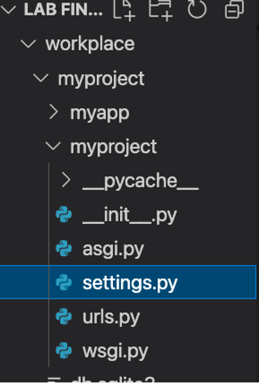
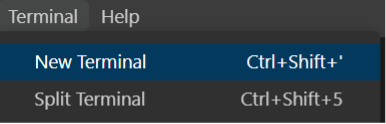
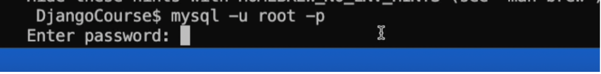
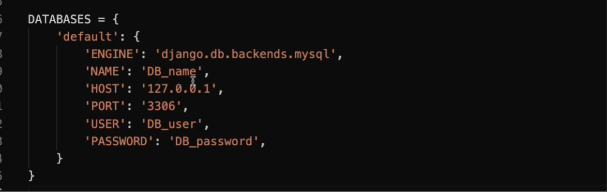

# **Ungraded Lab**

Connecting to a Database


### **Goal**

- Learner will create and connect to a MySQL database that can be used inside a Django project.

### **Objectives**

- Learner will create new MySQL database credentials.
- Learner will update the project settings in Django to enable connection with MySQL.


### **Introduction**

So far, you've learned how to work with the default SQLite database inside your Django project.

In this lab you will create and connect to an external MySQL database that can be used inside a Django project.

### **Scenario**

The owners of Little Lemon are appreciative of the feedback they receive from their customers.

While the scale of the website is relatively small, they still want to have the ability to scale quickly should the business expand.

For example, Adrian has expressed interest in building eCommerce functionality for an online shop and implementing an entire online reservation system for table bookings in the future.

As demand increases and functionality expands, the project may require the use of other database solutions instead of the SQLite database provided by default.

You are tasked with using your existing database creation and connection knowledge to accommodate these requests.

You are required to complete the settings for MySQL database connection with the Django project in place.


## **Initial lab instructions:**

This lab will require you to modify the following files:

- settings.py



Additionally, you are required to use the command line console inside the terminal of VS Code.

If not open already, go to ```Terminal``` on the Menu bar at the top of your screen and select ```New Terminal```.



You have already built the project named ```myproject``` and added an app inside the project called ```myapp```.

Follow the instructions below and ensure you check the output at every step.

# Steps

**Step 1:**
In the terminal, run the command that will enable access to mysql and enter the mysql shell by passing the ```-u``` and ```-p``` flags that will enable the MySQL console prompting for password.



**Note:** The default password set for mysql here will be blank. What it means is, when you receive a prompt for entering password, you will simply press the ```Enter``` key on your keyboard. 

**Step 2:**
 Once inside the mysql file, add the command to show the databases present already.

**Step 3:**
Create a new database with the name ```feedback``` by running a MySQL query.

**Step 4:**
Run the show database command and ensure the ```feedback``` database is present already.

Note: The mysqlclient is already installed as the MySQL database connector.

**Step 5:**
Run the command to exit the mysql shell

**Step 6:**
 Inside your Django project, open the ```settings.py``` file and go to ```DATABASES``` option.

**Step 7:**
 Select the values assigned to it by default and replace them with the following code:




**Step 8:** After you enter the values, and your code is the same as seen in the screenshot above, replace the values for the following:


| NAME: | 'feedback' |
| --- | --- |
| USER: | 'root' |
| PASSWORD: | '' |
| ENGINE | 'django.db.backends.mysql' |


Save the ```settings.py``` file.

**Step 9:**
 In the terminal, run the command to make migrations. Make sure you are inside the directory that contains ```manage.py``` file.

**Note:** No visible migrations will be performed after the first command is entered.

**Step 10:**
 Run the command to perform the migration.

## Concluding Thoughts

In this lab, you practiced connecting to a MySQL database.