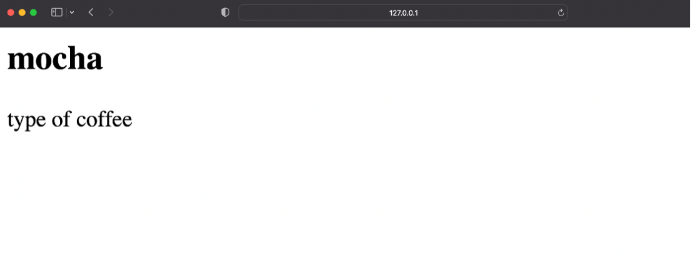
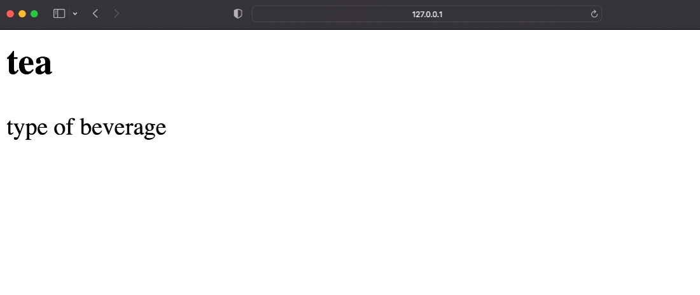

## Mapping URLs with Params


### Goal

In this lab, learners will practice working with Django URL dispatcher and how it tries to match URLs to URL patterns.

### Objectives

- Learner will define dynamic URL paths using path converters to capture a value from the URL, using angle brackets.
- The learner will practice capturing URL paths and print paths as Headings on the webpage.


### Introduction

By now you know how to define URLs and map them to view functions that return webpage content using the HttpResponse object.

In this lab, you will practice working with the Django URL dispatcher and how it tries to match URLs to URL patterns.

### Scenario

Mario, the other owner of Little Lemon is considering ways in which the website can be made attractive for its visitors. One idea that he found interesting was to provide an option of giving detailed info about different menu items on directly entering the item names in the URL. You are assigned to help Mario with this task.

### Learner Instructions

This lab will require learner to modify the following files:

- views.py
- urls.py (app-level)

Additionally, you must start the development server on local host and go to the URL to confirm the desired view on the webpage.

You have already built the project named 'myproject' and added an app inside the project called 'myapp'. The settings inside the ```settings.py``` file are already updated and project-level ```urls.py``` is updated with reference to the app-level URL configuration.

Follow the instructions below and ensure you check the output at every step:

**Step 1:**
Create a ```urls.py``` file at the app level, add the ```path()``` function inside the ```urlpatterns``` list and pass the following arguments to it:

- A path string beginning with suffix ```'drinks/'``` followed by a string path converter that has a variable called ```drink_name```.
- The relative path of the view function ```drinks()```
- A parameter called ```name``` with a value of ```'drinks'```


The configured path will look such as:

```path('drinks/<str:drink_name>', views.drinks, name="drinks"),```

**Tip:** Make sure to use ```<>``` when defining your path converter. 

Also make sure you have imported the views from the ```views.py``` file and the path function from ```django.urls``` package.

**Step 2:**
Inside ```views.py```, create a view called ```drinks()``` and pass two arguments to it: 
- the request object and 
- the drink_name variable you created inside ```urls.py```.

**Tip:** Make sure you have imported ```HttpResponse``` from ```django.http``` package

**Step 3:** create a dictionary inside the ```drinks()``` view function called ```drink()``` that has the following key-value pairs inside it:

- key 'mocha' with a value 'type of coffee'
- key 'tea' with a value 'type of beverage'
- key 'lemonade' with a value 'type of refreshment'

**Step 4:**
Now create a variable called ```choice_of_drink``` and assign it the 'value' of the ```drink_name``` by passing it inside the ```drink``` dictionary.

**Step 5:**
At the end of the function, return an HttpResponse object and pass the following arguments to it:

- ```•	f"<h2> {drinks} </h2>" ```
- concatenated by the variable ```choice_of_drink```

**Note:** ```<h2>``` here represents an HTML Heading tag.

**Step 6:**
 Go back to the console in the terminal and run the command to start the development server:

```python3 manage.py runserver```


**Tip:** Make sure you are running the command in the directory containing the file ```manage.py```

**Step 7:**
The command prompt will generate some text including a link for the localhost URL such as [http://127.0.0.1:8000/](http://127.0.0.1:8000/).

Click on the 'Browser Preview' option among the left hand menu options inside VSCode. Now copy the URL ```http://127.0.0.1:8000/``` generated above and paste it inside the Browser Window that has opened inside the VSCode.

**Step 8:**
Inside the browser go to the paths below and check you get the expected output:

```http://127.0.0.1:8000/drinks/mocha```



```http://127.0.0.1:8000/drinks/tea```



```http://127.0.0.1:8000/drinks/lemonade```


### Additional step:

- Create a new key-value pair of your choice inside the dictionary
- Run the server again
- Go to the URL with the new value and check the result


### Concluding thoughts

In this lab, you practiced defining dynamic URL paths using path converters to capture a value from the URL, using angle brackets. You also practiced capturing URL paths and printing paths as Headings on the webpage.