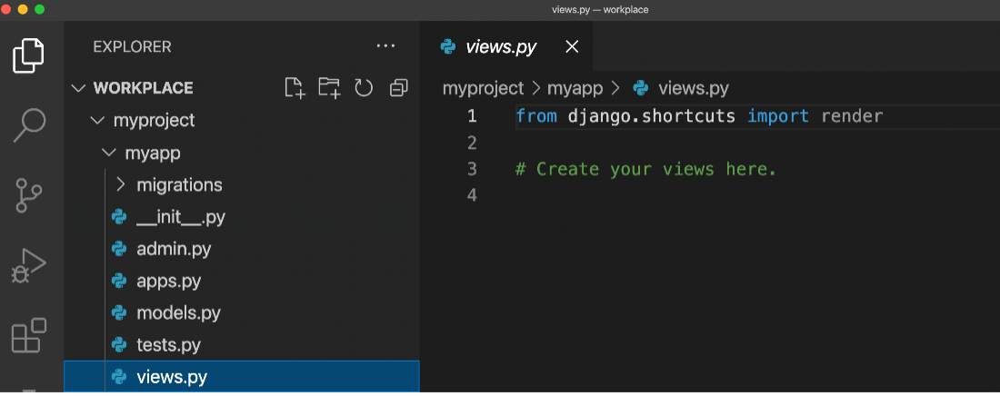
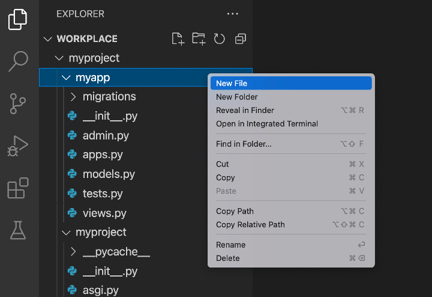
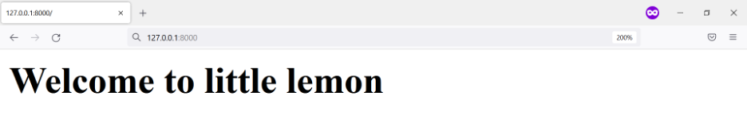

# Creating a view and URL configuration

### Introduction

So far, you've learned how to create a Django project inside a virtual environment, and install an App.
In this lab you will create a view function and add URL configuration in Django.


### Goal
* To create a view, add URL configuration and display contents on a webpage

### Objectives
* Learn how to create a view inside the views.py
* Add URL configurations at the project level using include() function


### Scenario
Now that you have a Django project and app created for the Little Lemon prototype. It's time to create its first webpage. 

In this lab, you'll create a view function and return a webpage containing some text using the HttpResponse object. 

### Learner Instructions

Ensure you are in the directory where you want to create your project.

This lab will require learner to modify the files: 
* views.py, 
* urls.py(project-level), 
* urls.py(app-level) and 
* settings.py

Additionally, you will run commands inside the VS Code console.  
If not open, go to Terminal on your Menu bar at the top of your screen and select 'New Terminal'.  


Finally, you will start the development server on local host and go to the URL to confirm the desired view on the webpage. 
You have already built the project named 'myproject' and added an app inside the project called 'myapp'.  
    
Follow the instructions below and ensure you check the output at every step:


**Step 1:** Make sure you have Django installed. If not installed, use pip to run the command to install Django.

**Tip: ** You can check that Django has been successfully installed by checking the version using the following command.

```python -m django --version```

**Step 2:**  The project and app are already in place. Run the change directory command to go inside the project directory by typing: 

```cd workplace/myproject```

**Tip:** You can check this was successful if the console prompt has a suffix  ‘myproject’.


**Step 3:** Inside the left explorer panel in VS Code, expand the 'myapp' directory and open  the file called 'views.py'.



**Step 4:** Inside the ```views.py``` file: 
* Import HttpResponse from the package django.http
* Define a function called ```home()``` and pass ```request``` object to it as a parameter
 

**Step 5:** Inside the function body of the view function you have created, use the return statement to return an ```HttpResponse()``` object and pass the following string to it:
```
<h1> Welcome to Little Lemon! </h1>
```
**Step 6:**  Create a file inside the ```myapp``` directory called ```urls.py```. 



Inside urls.py, add the following code inside it.

```
urlpatterns = [ 
    path('', views.home, name="home"), 
] 
```
**Step 7:** Additionally you need to add the import packages to use the path() function and home() function inside the views.py file. To do that:

* Import ```path``` from ```django.urls```
* Import views from (```.```)

**Note:** dot (```.```) here indicates the same working directory as the file. 

**Step 8:** Expand the ```myproject``` folder on the left panel and open the file ```urls.py```.

**Tip:** make sure you open the ```urls.py``` for the project and not the app.

**Step 9:** Inside the ```urls.py``` file, import the function: ```include```, from the package ```django.urls```.

**Step 10:**  Add a new path function inside the ```urlpatterns``` list and pass two arguments to it:
* An empty string
* The ```include()``` function that has ```myapp.urls``` passed inside it as a string

**Tip:** Don’t forget to add the comma(```,```) after the line of code for the view function and also between the arguments passed to the path function.

**Step 11:**  Open the settings.py file and register the app by adding the following string to the option INSTALLED_APPS present inside it: ```myapp.apps.MyappConfig```:
```
INSTALLED_APPS = [ 
    'django.contrib.admin', 
    'django.contrib.auth', 
    'django.contrib.contenttypes', 
    'django.contrib.sessions', 
    'django.contrib.messages', 
    'django.contrib.staticfiles', 
    'myapp',
] 
```
**Tip:** Make sure you add a comma ```,``` after the string.

**Step 12:** Go back to the console in the terminal and run the command to start the development server:

```python3 manage.py runserver```


**Step 13:**  The command prompt will generate some text including a link for the localhost URL such as 
```http://127.0.0.1:8000/```

Click on the 'Browser Preview' option among the left hand menu options inside VSCode. Now copy the URL ```http://127.0.0.1:8000/``` generated above and paste it inside the Browser Window that has opened inside the VSCode.



 
### Concluding Thoughts
In this lab, you practiced creating a view function and adding URL configuration in Django. 
