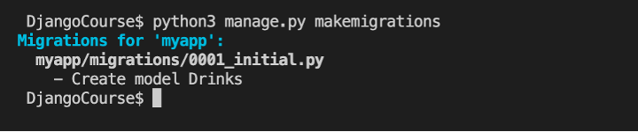
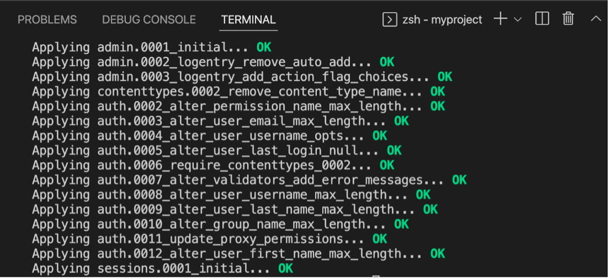
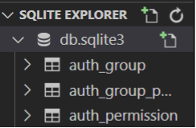

## Models & Migrations

### Goal

To create a model, learn to perform migrations and track changes in the model. Objectives

- The learner will create a model called ```Drinks```.
- The learner will perform the steps required to apply migrations


### Introduction

By now you have learned how to work with the view part of the Model View Template (MVT) pattern.

You can create view functions and map them to URLs.

The labs in this model will focus on the model part of the MVT pattern and in this lab, you will create and migrate a model called 'Drinks'.

### Scenario

The Little Lemon prototype web application is progressing well. Now that you have view function mapped to URLs, it's time to work with the data model.

You are assigned the task of creating a model that will be used as a database for storing the different menu items that are to be displayed on the Little Lemon website. In this scenario, you will design a model for a drinks menu that will list the beverages available at Little Lemon.

### Learner Instructions

This lab will require you to modify the following files:

- models.py
- admin.py

Additionally, you are required to use the command line console inside the terminal of VS Code.

If not open already, go to 'Terminal' on the Menu bar at the top of your screen and select 'New Terminal'.


You have already built the project named ```myproject``` and added an app inside the project called ```myapp```.

Follow the instructions below and ensure you check the output at every step and update the necessary files to create different views.


### Steps

**Step 1:**
Expand the ```myapp``` folder on the left-hand side menu and open the ```models.py``` file.


**Step 2:**
 Create a class called ```Drinks``` inside ```models.py``` and inside the class, pass ```models.Model``` to it as an argument.

**Step 3:**
 Inside the ```Drinks``` class, create the two attributes that you will require in the model and assign the respective form fields to them.

Additionally pass the following specified arguments to those form fields:

| **Attribute** | **Form field type** | **Arguments passed** |
| --- | --- | --- |
| drink | CharField | max\_length = 200 |
| price | IntegerField |
 |

**Tip:** Remember that the form fields are present inside the ```models``` module imported by default.

**Step 4:**
Open the ```admin.py``` file and register the Model that you created by passing the model name to the function ```admin.site.register()```.

**Tip:** Make sure you have imported the model from the ```models.py``` file.

**Step 5:** Step inside the project directory and run the development server.

**Note:** This will generate the ```db.sqlite3``` database that we use by default in Django.

**Step 6:**
Still in the terminal, step inside the project directory and run the command to make migrations.

Tip: The output must look similar to:



**Step 7:**
Run the command to perform the migration.

**Tip:** Check the information displayed in the command line to make sure that the migrations ran successfully without error. It should look something like the image below:



**Step 8:**
Once you are sure that the migrations ran successfully, return to the ```models.py``` file and modify the attribute name from ```drink``` to ```drink_name```.

**Step 9:**
Run both the commands required to perform migrations one more time.

**Note:** A confirmation prompt will appear to confirm the changes. Type ```y``` to confirm the changes.

**Step 10:**
In the left explorer panel in VS Code, search for the folder 'migrations' and a file such as ```0001\_initial.py``` and ```0002_rename...py```. Open the files and explore their contents.

Notice that these files contain a list of operations and dependencies specific to the migration performed.

**Step 11:**
Run the command to show the migration changes.

**Step 12:**
In the left explorer panel in VS Code, right click on the database ```db.sqlite3``` that is generated and select ```Open Database```.

**Step 13:**
Notice that a menu open for ```SQLITE EXPLORER``` appears at the bottom of the left pane.



Now go to ```SQLITE EXPLORER``` and expand the option for ```db.sqlite3```.

Scroll down to check if the ```myapp_drinks``` table is generated.

**Note:** You may not see any contents inside the ```myapp_drinks``` table as it is empty.

## Concluding thoughts

In this lab, you practiced creating model (```Drinks```) and ran the migrations to create the associated database tables.