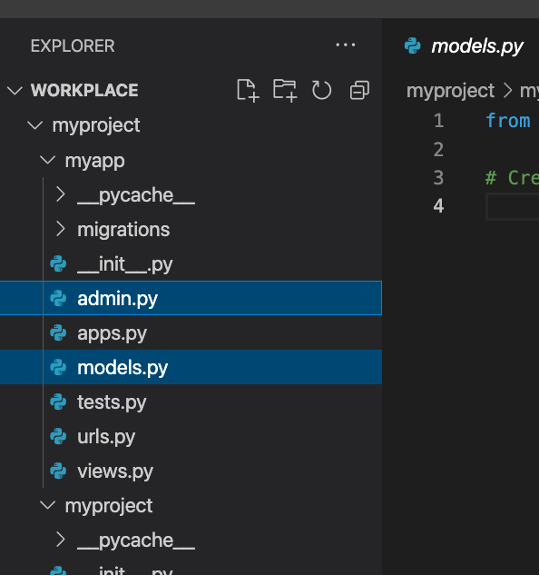
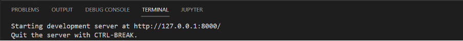
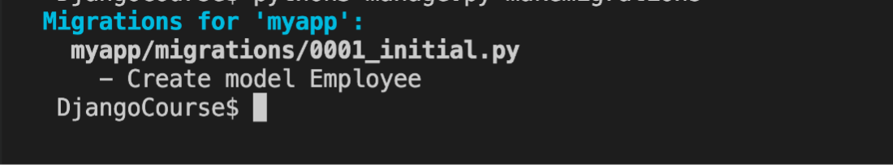
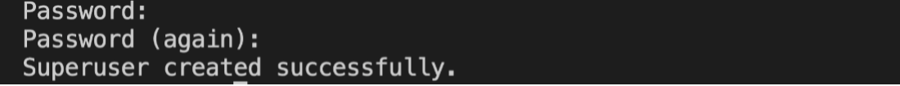
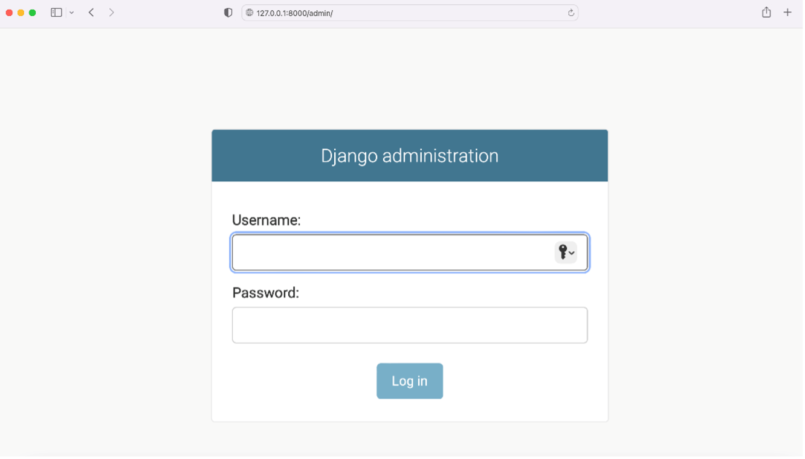
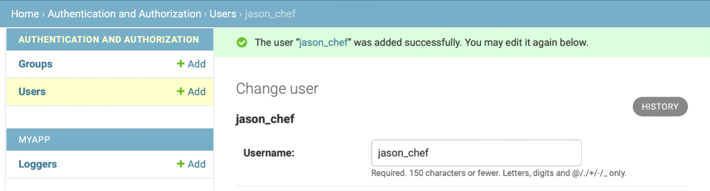
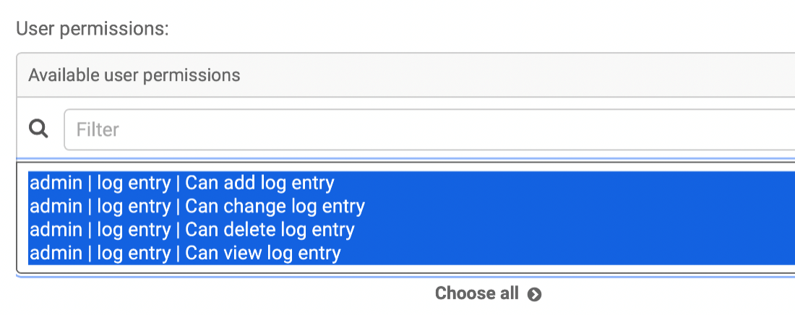

# Using Django Admin


### **Goal**

- Learner will learn to use the Django admin panel.

### **Objectives**

- Learner will create a super user that will have administrative rights.
- Learner will create an entry for a specific user and create another new user and assign specific permissions to it using the admin panel of Django.


### **Introduction**

In this lab, you will create a model called ```Employees``` and learn how to use the Django admin panel for creating users and assigning permissions to those users.

### **Scenario**

The owners Adrian and Mario feel there is a better way to track their employees' hours and responsibilities and have created a database of their employees. While the commands in the Django shell can be used for making changes, neither of the owners have a technical background and prefer an easier way to address this. You have been assigned the task of providing a user interface to Adrian and Mario by setting up the Admin panel.

This lab will require you to modify the following files:

- models.py
- admin.py



Additionally, you are required to use the command line console inside the terminal of VS Code.

If not open already, go to ```Terminal``` on the Menu bar at the top of your screen and select ```New Terminal```.




You have already built the project named ```myproject``` and added an app inside the project called ```myapp```.

You have already built the project named ```myproject``` and added an app inside the project called ```myapp```.

Follow the instructions below and ensure you check the output at every step:


## Steps

**Step 1:**
Create a class called ```Employees``` inside the file ```models.py```. Inside it, pass ```models.Model``` as a parameter.

**Step 2:**
 Create the four attributes that you are going to require in the model and assign the respective form fields to them. Additionally pass the specified arguments to those form fields:

| **Attribute** | **Form field type** | **Arguments** |
| --- | --- | --- |
| first\_name | CharField | max\_length = 200 |
| last\_name | CharField | max\_length = 200 |
| role | CharField | max\_length = 100 |
| shift | IntegerField |

**Step 3:**
Go to the file ```admin.py``` and register the Model that you created by passing the model name to the function ```admin.site.register()```.

Tip: Make sure you have imported the ```Employee``` model inside the ```admin.py``` file.

**Step 4:**
Open the file ```settings.py``` and make sure the app configurations are present inside ```INSTALLED_APPS``` list.

Tip: They can look either like ```'myapp'``` or ```'myapp.apps.MyappConfig'```.

**Step 5:**
In the terminal run the command to make migrations using both required commands.

Tip: Ensure you are in the directory that contains the ```manage.py``` file.

Note: The output of the first command will look similar to the screenshot below:



**Step 7:**
Run the command to create a super user using the script from ```manage.py```.

**Tip:**
 Recall the use of keyword ```createsuperuser```

**Step 8:**
Add the following details for username, email, password and password confirmation.

| Username | admin |
| --- | --- |
| Email | admin@littlelemon.com |
| Password | lemonAdmin@3! |
| Password confirmation | lemonAdmin@3! |

**Note:** After addressing all the prompts on the screen, you should get a message such as:



**Step 9:**
 Run the command to run the server and launch the browser at the localhost URL.

**Step 10:**
 In the browser address bar, type the URL that will render the administration login page.

Tip: It will mean adding the suffix for the admin page to the localhost URL.



**Step 11:**
Enter the login credentials you just created in the form that appears, and log in to the admin panel.

**Step 12:**
Go to the ```Employees``` table under the ```myapp``` section and click on the ```Add Employee``` button.

**Step 13:**

Add the following details for the employee:

- First name: Priya
- Last name: Giti
- Role: Chef
- Shift: 1

Save the details by clicking the ```Save``` button. Notice that the ```Employee object(1)``` will be created.

**Step 14:** Now keep the server running and Django admin open, go back to the file ```models.py```. Inside the ```Employee``` class, add the following code at the bottom:

```
def __str__(self) -> str:
   return self.first_name

```

Save the ```models.py``` file.

Go back to the Admin page in the browser, and refresh the Employee page on the screen.

Notice that the ```Employee object(1)``` now changes to ```Priya```.

**Step 13:**
Next go to the ```Users``` section, and add a new user by first clicking ```Add user```. Next enter the details requested for username, password and password confirmation.

| Username | jason\_chef |
| --- | --- |
| Password | lemonChef@123! |
| Password confirmation | lemonChef@123! |

**Step 14:** Make sure a notification for adding user such as ```jason_chef``` is visible on the screen.



**Step 15:** Select the new user created under the 'Users' tab and update the Staff status 'Permissions' to the new user.

Assign all the user permissions for ```admin | log entry``` to the new user. From the table  ```Available user permissions```, select the specific permissions by clicking on the right arrow button to move them to the ```Chosen user permissions``` table.



Finally, go to the bottom of the screen and click on ```SAVE``` button.

Note: The visibility of ```Chosen user permissions``` on the screen is subjective to the screen resolution.


## Concluding Thoughts

In this lab, you practiced creating a super user that has administrative rights to use the Django administration panel. You also practiced creating an entry for a specific user and assigning permissions using the admin panel of Django.