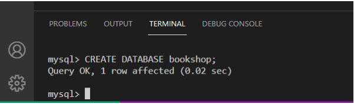
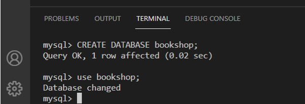
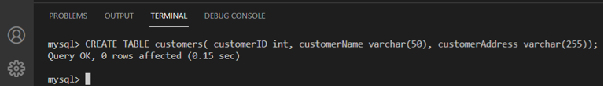
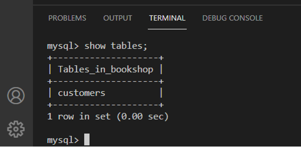
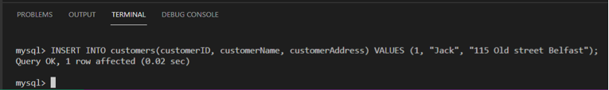
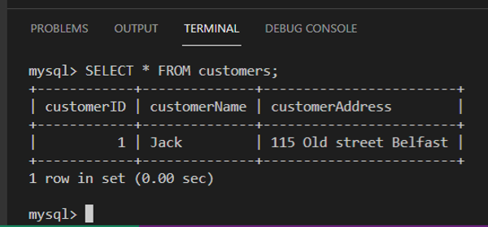

# C1M2L2 – (Exercise: Create Database, create table and insert data)

<br><br>
 ### **Tips: Before you Begin**
> - To view this file in Preview mode, right click on this LabInstructions.md file and `Open Preview`

<br>
<br>

The goal of this exercise is to take you through a step-by-step process for creating a database, creating a table in the database and inserting data into the table. The objective is to provide you with an opportunity to practice how to create a database, a table and insert data.   

#### Scenario
Mr. John Ericson owns a small bookshop. He decides to build a digital database to maintain data about his customers electronically instead of using pen and paper. In this exercise, you’ll build the bookshop database. 

Note: You are required to complete this exercise inside MySQL on the Coursera platform. If you have any doubts about how to access it, please view the readme file available in the course webpage. 

#### Instructions
Please attempt the following tasks before you continue so you can check and compare your answers with the solution.

* Task 1: Create a database called bookshop. 
* Task 2: Create a table called customers with customer ID, name, and address.  
* Task 3: Insert a record of data for one customer. 


**Task 1: Create a database**

Inside the terminal, write the “CREATE DATABASE” command followed by the name of your new database. In this case, the database name is called “bookshop”. Finally, add a semi-colon at the end of the statement and click enter on the keyboard to execute the following query: 

```SQL
CREATE DATABASE bookshop; 

```

Below is a screenshot of the create database statement inside the terminal.  



Well done, you have now created the bookshop database. 

**Task 2: Create a table**

1-To create the customers table inside the bookshop database, you need to first choose the bookshop database by typing: 

```SQL
use bookshop; 

```




2-Write the create table statement. To create the customers table, write an SQL statement  that contains the CREATE TABLE command followed by the name of the table, which is “customers” in this case. Then add an open parenthesis to define the table’s columns including the customer ID, customer name and customer address. 

Of course, each column must be assigned a suitable datatype. Once all required columns have been defined, you must add a closing parenthesis and a semi-colon at the end of the SQL statement as follows: 

```SQL
CREATE TABLE customers( customerID int, customerName varchar(50), customerAddress varchar(255));

```

3-Click enter to execute the SQL statement. The output result below confirms the query is okay, which means the table has been successfully created.



4-To show the table you have already created you can simply type:

```SQL
Show tables;

```

The customers table will appear as part of the tables in the bookshop database. 




**Task 3: Insert data**

1-Now, let's add our first customer data into the customer table! This can be done by writing the following SQL statement, which inserts a set of relevant values that each correspond to a specific column. Please verify that your create statement values reflects the defined data type of your columns and  lists values in the right order.  

```SQL
INSERT INTO customers(customerID, customerName, customerAddress) VALUES (1, "Jack", "115 Old street Belfast");

```

In this statement, you declare the INSERT INTO clause, followed by the name of the table. In this case it’s the “customers” table. Then you add the column names within a pair of parentheses. Next, you insert the VALUES keyword and then add the values you want to assign to each column within a pair of parentheses. In this case the ID is 1, the name is Jack and the address is 115 Old street, Belfast. Note that all VARCHAR columns values must be written within double quotations, whereas numbers do not require that. 


2-Press enter to execute the SQL statement. 

The output result below confirms the query is okay, which means the record of data has been successfully inserted. 



3-You can type the following select SQL statement to get the content of the customers table after inserting the data. 


```SQL
SELECT * FROM customers; 

```

4-Press enter. The output result will be all records of data existing in the customer table, as displayed below:



In this exercise, you have practiced creating a table in a database and inserting data into the table. Here is an additional task for you to test your skills.  


**Additional task (optional)**

Mr. Ericson  wants to insert another record of data for another customer with the following details: the ID is 2, the name is James and the address is 24 Carlson Rd London. Your task now is to add the customer's details into the customer table.  


**Solution**
Write the following SQL statement in the SQL editor in phpMyAdmin then click the Go button to execute it.

```SQL
INSERT INTO customers(customerID, customerName, customerAddress) VALUES (2, "James", "24 Carlson Rd London")  

```


